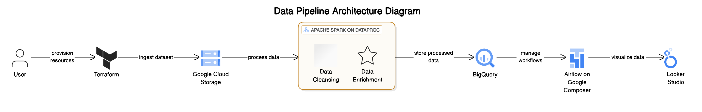
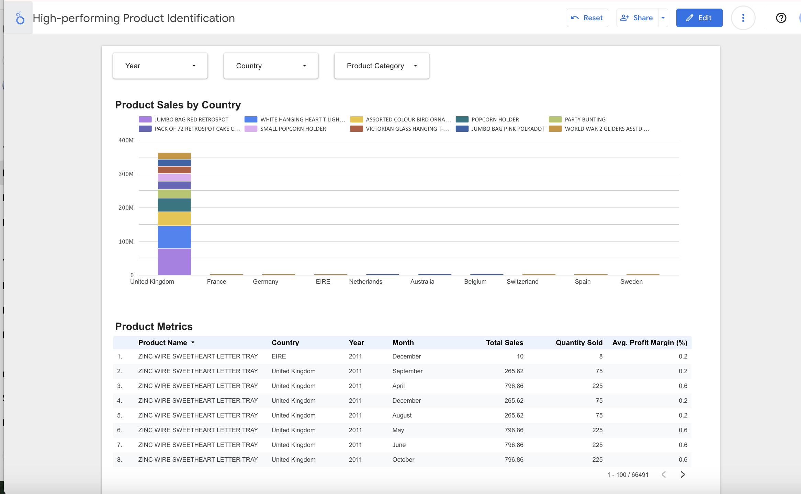

# Retail Intelligence Platform: Batch Analytics Pipeline  

## Project Summary

### Problem statement

Retail businesses often struggle to turn raw transactional data into actionable insights due to data silos, inconsistent formats, and lack of scalable processing. The goal of this project is to design and implement a batch data processing pipeline that ingests, processes, and analyzes e-commerce retail transaction data to deliver product performance insights, sales trends, and customer behavior analytics using GCP-native tools.

The processed data will power a Looker Studio dashboard providing business users with:

* High-performing product identification
* Seasonal trends and demand forecasting
* Profitability insights by product and country

## Data Pipeline Architecture

- **Terraform**: Infrastructure provisioning on GCP  
- **GCS**: Store raw & processed data  
- **Dataproc (Spark)**: ETL at scale  
- **BigQuery**: Analytics-ready data warehouse  
- **Cloud Composer (Airflow)**: Pipeline orchestration  
- **Looker Studio**: Business intelligence dashboard  




### 1. Data Ingestion (GCS)
The raw dataset, titled UK Online Retail Data from Kaggle, is extracted and ingested into a GCS bucket using a Python script named Extract_Online_Retail_Data.py, located in the project folder. This script runs on a Dataproc cluster and is orchestrated and monitored via Google Cloud Composer (Airflow). The ingested data is in CSV format.

### 2. Data Exploration

The dataset consists of 541,909 records, each representing a line item (product) from customer invoices. Since multiple items can be associated with a single invoice, repeated invoice codes indicate multi-item purchases—essentially, each row represents a product within a transaction.

From the sample data:

* `InvoiceDate` includes both the date and time, allowing for time-based analyses (e.g., time of day, day of the week, and seasonal patterns). Although stored as a string, this field will be converted to a timestamp.
* `CustomerID` 17850.0 appears frequently, suggesting this may be a wholesale buyer or a frequent shopper. This field is currently a float but will be cast to an integer.
* Products like "WHITE HANGING HEART...", "WHITE METAL LANTERN", and "BOX OF VINTAGE..." occur repeatedly, potentially indicating best-sellers or items commonly sold in bundles.
* Orders typically include small to medium product quantities (e.g., 3, 6, 8, 32).
* The majority of `UnitPrice` values are relatively low, typically under £10.
* No duplicate records were found in the dataset.

    #### 2.1 Data Quality Considerations
    Analysis of the dataset shows that the CustomerID field has 135,080 missing values, while the Description column contains 1,454 null entries. These gaps in the data will require appropriate imputation strategies to ensure completeness and reliability for further analysis.

### 3. Data Processing (Apache Spark on Dataproc)

#### 1. Data Cleaning and Imputation

- **CustomerID Handling**
  - Fills missing `CustomerID` using the most common ID per `InvoiceNo`.
  - Remaining nulls are filled with the most frequent customer in the entire dataset.

- **Description Handling**
  - Missing `Description` values are filled with the most common one per `StockCode`.
  - Any remaining nulls are replaced with the overall most common description.

#### 2. Feature Engineering

- Extracts components from `InvoiceDate`:  
  - `Year`, `Month`, `MonthName`, `DayOfWeek`, `NameOfDay`

- **Sales Value Calculation**
  - `SalesValue = Quantity × UnitPrice`

- **Profit Margin Estimation**
  - `CostPrice = 0.8 × UnitPrice`  
  - `ProfitMargin = (UnitPrice - CostPrice) / UnitPrice`

#### 3. Aggregation and Product Performance

- **Sales Volume Aggregation**
  - Aggregated by `StockCode`, `Year`, `Country` to compute `TotalSales` and `TotalQuantity`.

- **Profit Margin Aggregation**
  - Computes average `ProfitMargin` and total profit-related sales.

- **Categorization**
  - Uses `ntile(3)` to categorize products into `Low`, `Medium`, `High` for:
    - `SalesCategory_in_sales`
    - `ProfitCategory`

- **Merge with Main Dataset**
  - Joins performance metrics back to the main cleaned dataset.

### 4. Data Warehousing (BigQuery)

The cleaned and enriched data is loaded into Bigquery for analytics. The data is optimised by partitioning by InvoiceDate and clustering by CustomerID

### 5. Data Orchestration (Airflow on Google Composer)
This uses Airflow DAG to orchestrates an ETL pipeline for online retail data using Google Cloud Composer and Dataproc.

#### Workflow Steps
  **1** `test_python_env`
- Submits a job to verify the Python environment (Anaconda Python).
- Ensures compatibility before running main jobs.

  **2** `extract_data`
- Runs the `Extract_Online_Retail_Data.py` PySpark script.
- Extracts raw data and possibly stages it in GCS.

  **3** `load_online_retail_data`
- Executes `Transform_Online_Retail_Data.py` to transform and load the data.
- Loads cleaned data into BigQuery (`online_retail.retail`) with table overwrite.

#### Execution Flow
```
test_python_env → extract_data → load_online_retail_data
```

### 6. Data Visualisation (Looker Studio)
The interactive dashboard titled High-performing Product Identification has been created to provide insights into top-performing products. It includes a comprehensive view of Product Sales by Country and a Product Metrics Table. The dashboard allows users to filter data by Year, Country, and Product Category for more granular analysis.

Below is a snapshot of the visualization, showcasing the dynamic charts and tables designed for exploring product performance across various dimensions.




Here is the link to request access to the report: https://lookerstudio.google.com/reporting/67cb854c-2e3c-4aba-9858-237462cabdcf

---

# References

1. TheDevastator. (2022) Online Retail Transaction Data. Kaggle. Available at: https://www.kaggle.com/datasets/thedevastator/online-retail-transaction-data
2. Apache Software Foundation. (2024) Apache Spark™ - Unified Analytics Engine for Large-Scale Data Processing. Available at: https://spark.apache.org/
3. Google Cloud. (2024) BigQuery Documentation. Available at: https://cloud.google.com/bigquery/docs 
4. Harvard Business Review. (2021) How to Calculate and Use Profit Margins. Available at: https://hbr.org/2021/02/how-to-calculate-and-use-profit-margins
5. Rajaraman, A. and Ullman, J.D. (2012) Mining of Massive Datasets. 2nd edn. Cambridge: Cambridge University Press.
6. Databricks. (2024) PySpark Documentation. Available at: https://docs.databricks.com/pyspark/latest/ 
7. Kaggle. (n.d.) API Credentials and Usage. [online] Available at: https://www.kaggle.com/docs/api 
8. Python Software Foundation. (n.d.) pip – The Python Package Installer. [online] Available at: https://pip.pypa.io/en/stable/
9. Apache Spark. (n.d.) Apache Spark™ - Unified Analytics Engine for Big Data. [online] Available at: https://spark.apache.org/
10. HashiCorp. (n.d.) Terraform Configuration Language. [online] Available at: https://developer.hashicorp.com/terraform/language 
11. Google Cloud. (n.d.) Cloud Composer (Airflow) Documentation. [online] Available at: https://cloud.google.com/composer/docs
12. Google Cloud. (n.d.) BigQuery Documentation. [online] Available at: https://cloud.google.com/bigquery/docs
13. Google Cloud. (n.d.) Dataproc Documentation. [online] Available at: https://cloud.google.com/dataproc/docs
14. Looker Studio (formerly Data Studio). (n.d.) Looker Studio Help. [online] Available at: https://support.google.com/looker-studio


